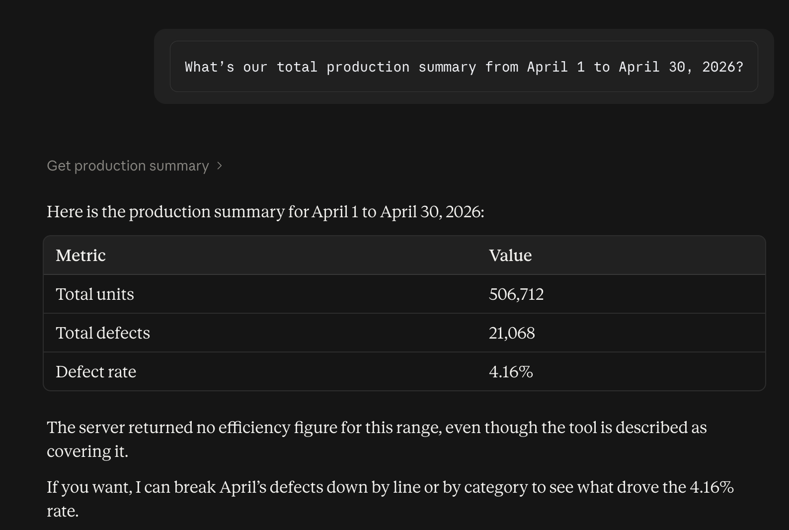
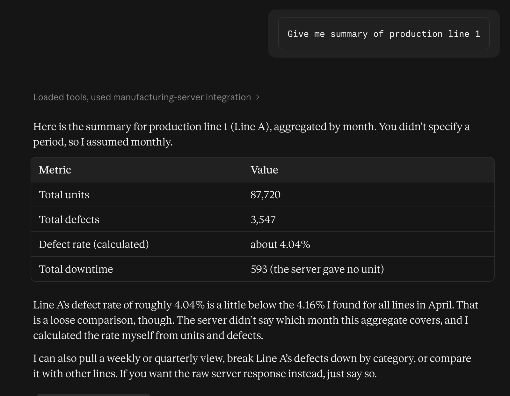
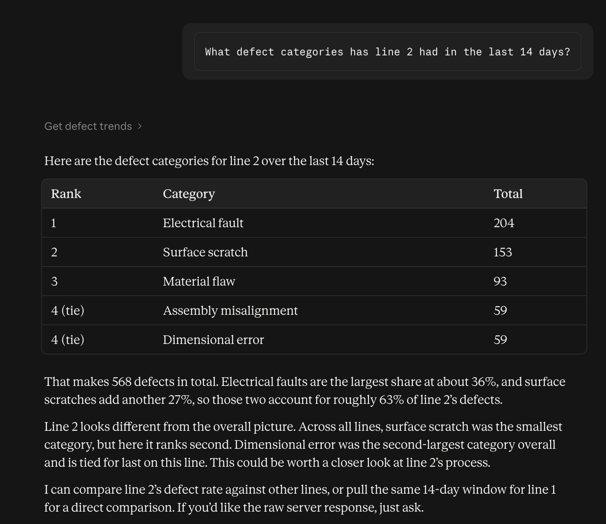
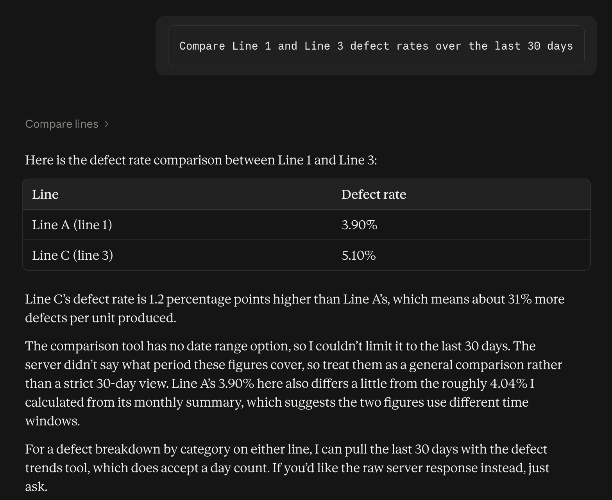
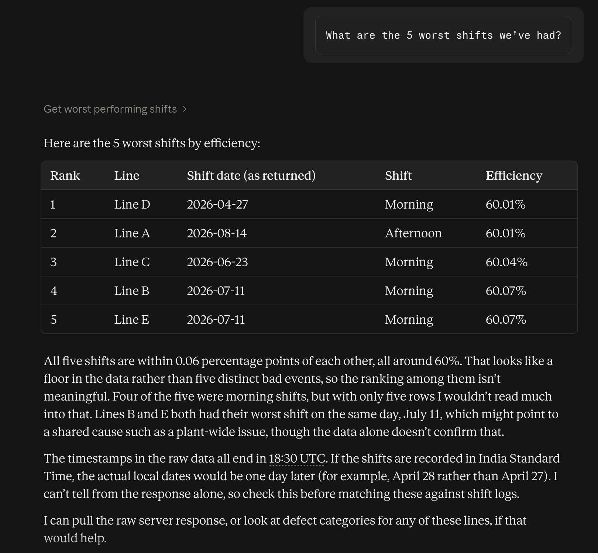
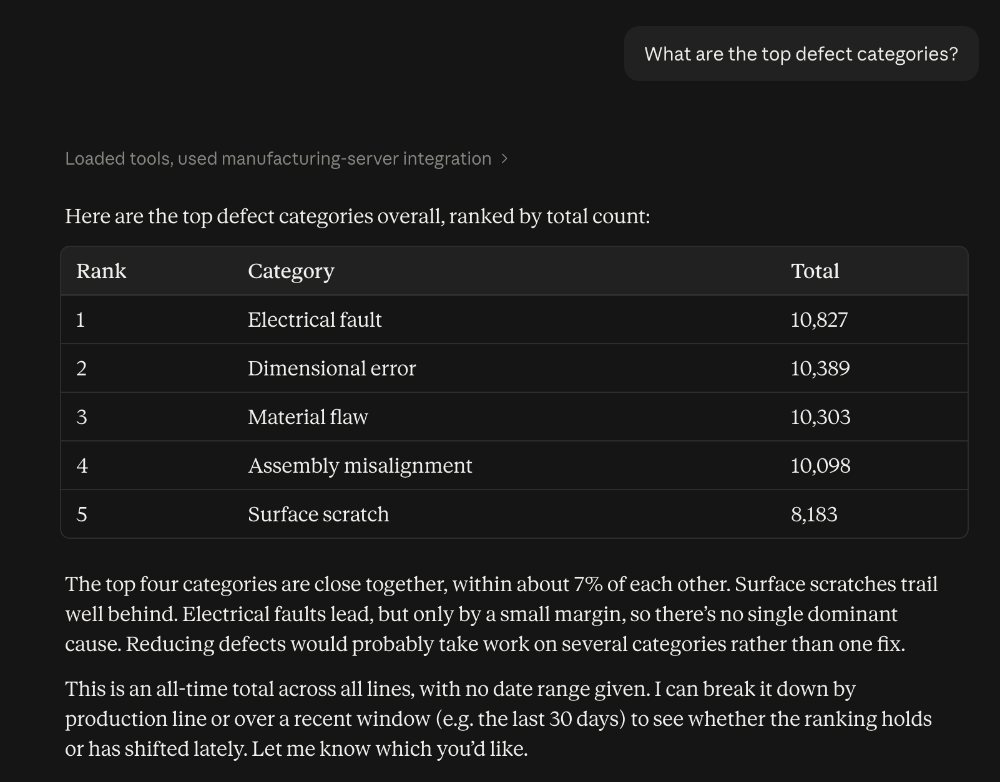

# manufacturing-insights-assistant
## MCP Tools

### get_production_summary(start_date, end_date)
Returns total units produced, total defects, and defect rate for a date range.

**Example call:** "What’s our total production summary from April 1 to April 30, 2026?"

**Example output:**
```json
{
  "total_units": "506712",
  "total_defects": "21068",
  "defect_rate_pct": "4.16"
}
```
**Claud Reponse:**


### get_line_performance(line_id, period)
Returns metrics for a specific production line over a period

**Example call:** "Give me summary of production line 1"

**Example output:**
```json
{
  "line_name": "Line A",
  "period": "month",
  "total_units": "87720",
  "total_defects": "3547",
  "total_downtime": "593"
}
```
**Claud Reponse:**


### get_defect_trends(line_id, days)
Returns defect breakdown by category over the last N days for a line

**Example call:** "What defect categories has line 2 had in the last 14 days?"

**Example output:**
```json
[
  {
    "defect_category": "electrical_fault",
    "total": "204"
  },
  {
    "defect_category": "surface_scratch",
    "total": "153"
  },
  {
    "defect_category": "material_flaw",
    "total": "93"
  },
  {
    "defect_category": "assembly_misalign",
    "total": "59"
  },
  {
    "defect_category": "dimensional_error",
    "total": "59"
  }
]
```
**Claud Reponse:**


### compare_lines(line_id, metric)
Compares multiple production lines on a given metric

**Example call:** "Compare Line 1 and Line 3 defect rates over the last 30 days"

**Example output:**
```json
{
  "metric": "defect_rate",
  "comparison": [
    {
      "name": "Line C",
      "value": "5.10"
    },
    {
      "name": "Line A",
      "value": "3.90"
    }
  ]
}
```
**Claud Reponse:**


### get_worst_performing_shifts(limit)
Returns the N worst shifts ranked by efficiency

**Example call:** "What are the 5 worst shifts we’ve had?"

**Example output:**
```json
[
  {
    "name": "Line D",
    "shift_date": "2026-04-27T18:30:00.000Z",
    "shift_type": "morning",
    "efficiency_percentage": "60.01"
  },
  {
    "name": "Line A",
    "shift_date": "2026-08-14T18:30:00.000Z",
    "shift_type": "afternoon",
    "efficiency_percentage": "60.01"
  },
  {
    "name": "Line C",
    "shift_date": "2026-06-23T18:30:00.000Z",
    "shift_type": "morning",
    "efficiency_percentage": "60.04"
  },
  {
    "name": "Line B",
    "shift_date": "2026-07-11T18:30:00.000Z",
    "shift_type": "morning",
    "efficiency_percentage": "60.07"
  },
  {
    "name": "Line E",
    "shift_date": "2026-07-11T18:30:00.000Z",
    "shift_type": "morning",
    "efficiency_percentage": "60.07"
  }
]
```
**Claud Reponse:**


### run_custom_analytics(question)
Answers a free-text manufacturing question by matching keywords to the right analytics query

**Example call:** "What are the top defect categories?"

**Example output:**
```json
{
  "interpreted_as": "top defect categories overall",
  "data": [
    {
      "defect_category": "electrical_fault",
      "total": "10827"
    },
    {
      "defect_category": "dimensional_error",
      "total": "10389"
    },
    {
      "defect_category": "material_flaw",
      "total": "10303"
    },
    {
      "defect_category": "assembly_misalign",
      "total": "10098"
    },
    {
      "defect_category": "surface_scratch",
      "total": "8183"
    }
  ]
}
```
**Claud Reponse:**
